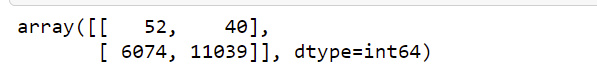
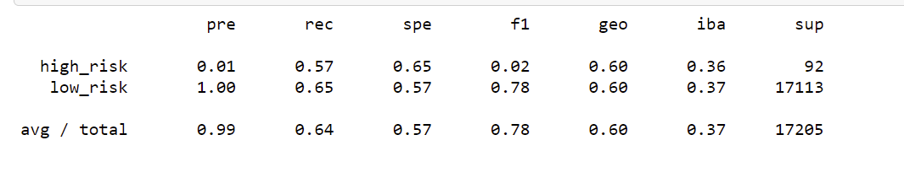
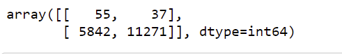
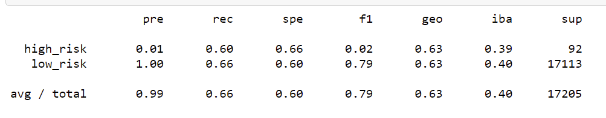

# Credit_Risk_Analysis

## Overview of Project

### Purpose
The purpose of this analysis to find the results from a unbalanced data. 
We need to balance the data before analysing to eliminate the biases. 

## Results

### Using Random oversampling 
1. The difference in data points between low risk and high risk is 51k with data points in low risk being high.
2. Using oversampling we increased the data points for high risk to match low risk. 

3. Imbalanced classification report

### Using SMOTE oversampling 
1. Using SMOTE oversampling technique we increased the data points for high risk to match the low risk. 

2. Imbalanced classification report using oversampling. 

