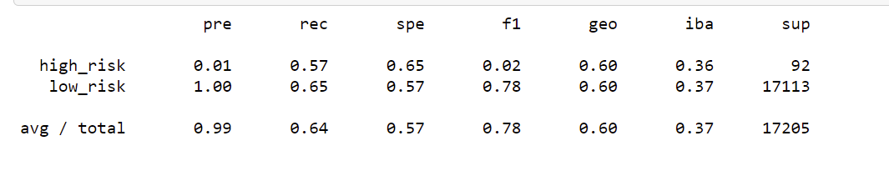
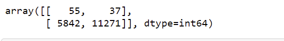
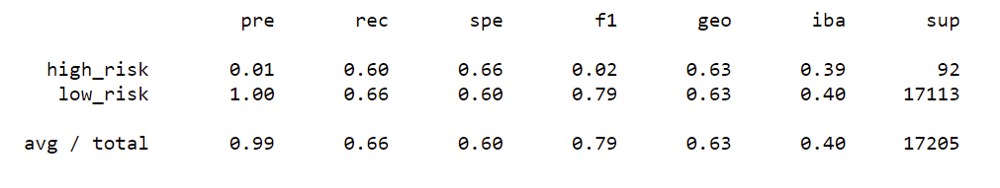

# Credit_Risk_Analysis

## Overview of Project

### Purpose
The purpose of this analysis to find the results from a unbalanced data. 
We need to balance the data before analysing to eliminate the biases. 

## Results

### Using Random oversampling 
1. The difference in data points between low risk and high risk is 51k with data points in low risk being high.
2. Using oversampling we increased the data points for high risk to match low risk. 

3. Imbalanced classification report

4. The accuracy score is 0.605141273224779

### Using SMOTE oversampling 
1. Using SMOTE oversampling technique we increased the data points for high risk to match the low risk. 

2. Imbalanced classification report using oversampling. 

3. Accuracy score is 0.6282240935571483

Looking at the output data, both the methods of oversampling the data generates almost similiar results. 
The difference in true positive values is only 3. Also the difference between the accuracy score is only 2%.

### Using Cluster Centroids algorithm for undersampling
1. In this method, the low risk data points are undersampled to 255 from 51357

2. Confusion Matrix

3. Imbalanced classification report

4. Accuracy score is 0.6282240935571483

